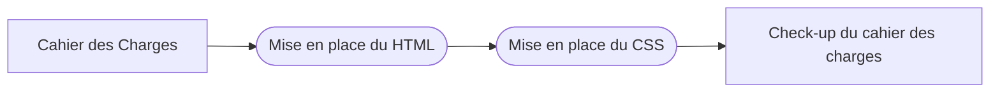

# booki-website

Projet réalisé pour ma formation OpenClassrooms avec un cahier des charges.

```mermaid
graph LR
A[Cahier des Charges] --> B([Mise en place du HTML]) --> C([Mise en place du CSS])
C --> D[Check-up du cahier des charges]
```
